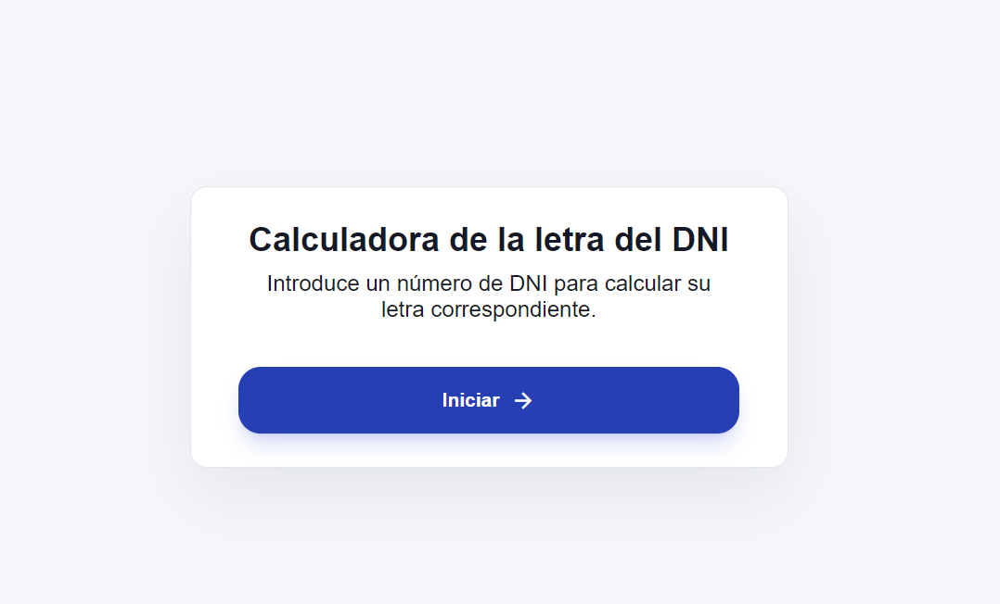
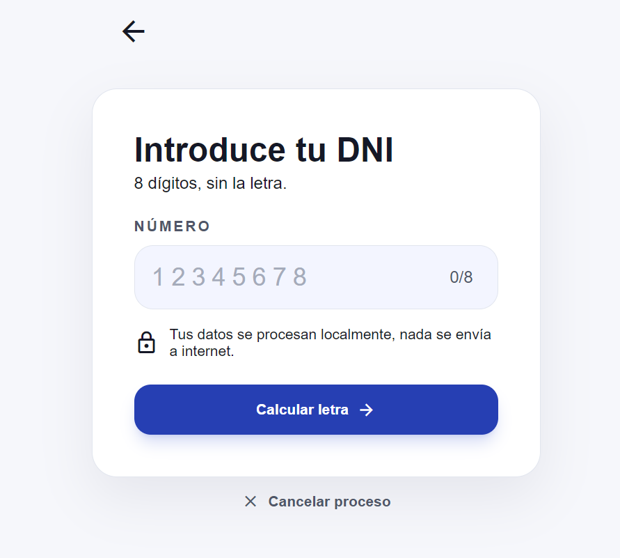
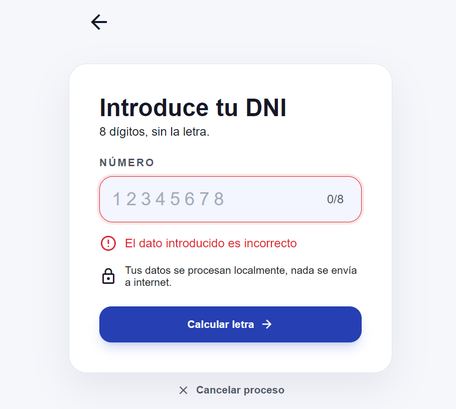
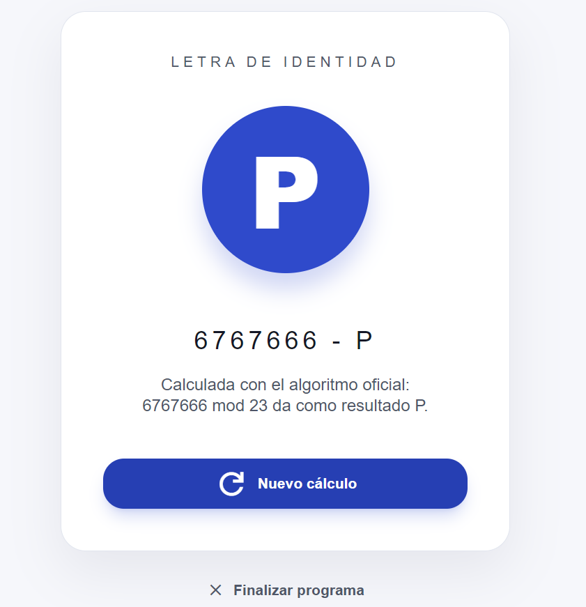
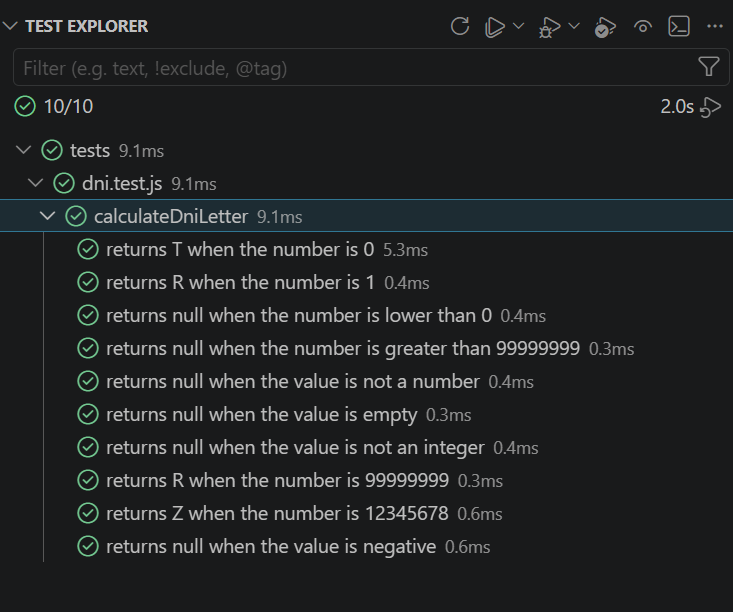

# Kata DNI

Web application for calculating the Spanish DNI letter from a number entered by the user.

## Preview









## Description

This project is a JavaScript kata focused on calculating the corresponding letter for a Spanish DNI number.

The algorithm works as follows:

1. The user enters a number between `0` and `99999999`.
2. The program calculates the remainder of dividing that number by `23`.
3. The matching letter is selected from the official letter table.

Official letter table:

```txt
TRWAGMYFPDXBNJZSQVHLCKE
```

Example:

```txt
12345678 mod 23 = 14
Matching letter: Z
Complete DNI: 12345678-Z
```

## Features

- Intro screen to start the application.
- Input field for the DNI number.
- Input validation.
- Error message for invalid values.
- DNI letter calculation using modulo `23`.
- Result screen with the calculated DNI letter.
- Option to start a new calculation.
- Option to cancel and finish the program.

## Covered Criteria

### Start the system

When the user clicks the **Start** button, the calculator screen is displayed.

### Valid DNI

When the user enters a number between `0` and `99999999`, the corresponding letter is calculated and displayed.

### Number out of range

When the user enters a number lower than `0` or greater than `99999999`, the following message is displayed:

```txt
El dato introducido es incorrecto
```

### Non-numeric value

When the user enters a value that is not a number, an error message is displayed.

### Process repetition

After completing a calculation, the user can enter a new number and calculate another DNI letter.

### Process cancellation

When the user clicks **Cancel**, the program finishes.

## Technologies

- HTML5
- CSS3
- JavaScript
- Vitest

## Project Structure

```txt
Kata---DNI/
  src/
    js/
      dni.js
      main.js
    styles/
      base.css
      buttons.css
      calculator.css
      layout.css
      main.css
      result.css
  tests/
    dni.test.js
  index.html
  package.json
  README.md
```

## Installation

Install the project dependencies:

```bash
npm install
```

## Run Tests

```bash
npm test
```

On Windows, if PowerShell blocks the `npm` command, use:

```bash
npm.cmd test
```

## Tests

The project includes unit tests for:

- correct DNI letter calculation
- numbers within the valid range
- numbers outside the valid range
- non-numeric values
- empty values
- decimal numbers
- the letter table based on modulo `23`

### Test Result



## Author

[Hanna](https://github.com/hannafr14)
